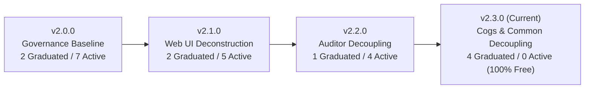

# Powercord Architecture & Governance Roadmap

This document outlines the phased roadmap for Powercord architectural modernization, modularization, and total graduation from the 500 LOC Architectural Debt Ratchet (`governance_ratchet.json`).

---

## 1. Architectural Debt Ratchet Overview

The 500 LOC Ceiling Law (`inv-500-loc-ceiling`) establishes that no source file shall exceed 500 lines of code. Legacy files exceeding 500 LOC are quarantined in `powercord/tests/governance/governance_ratchet.json`:
* **Zero tolerance for new code**: Any new file must strictly be $\le 500$ LOC.
* **Monotonic ratchet**: Line counts on quarantined files may only decrease.
* **Phased graduation**: Each quarantined file is assigned a concrete target release milestone below.

---

## 2. Release Milestones

### Milestone v2.0.0: Sovereign Governance & Invariant Hardening
* **Focus**: Establish Tier 0–2 Sovereign Invariant hierarchy, automated Pytest governance gates, universal `Justfile` task taxonomy, and ratchet initialization.
* **Target Graduations**:
  1. `powercord/app/ui/helpers.py` (681 LOC $\rightarrow$ `<350 LOC` split across `modal_helpers.py` and `guild_helpers.py`).
  2. `powercord/app/extensions/honeypot/cog.py` (534 LOC $\rightarrow$ `<380 LOC` split across `cog_views.py`).
* **Remaining Debt**: 7 files (~8,400 LOC).

---

### Milestone v2.1.0: Web UI & Dashboard Deconstruction
* **Focus**: Deconstruct top-level monolithic FastHTML routing and dashboard rendering into cohesive subpackages.
* **Target Graduations (Completed)**:
  1. `powercord/app/main_ui.py` (1,398 LOC $\rightarrow$ `<150 LOC` assembler, decomposed into `app/ui/routes/`).
  2. `powercord/app/ui/dashboard.py` (2,084 LOC $\rightarrow$ modular `app/ui/dashboard/` subpackage).
* **Remaining Debt**: 5 files (~4,900 LOC).

---

### Milestone v2.2.0: Security Auditor & Widget Engine Decoupling
* **Focus**: Decouple the monolithic security auditor and card rendering engine into pure computation and UI fragments.
* **Target Graduations (Completed)**:
  1. `powercord/app/extensions/utilities/widget.py` (2,783 LOC $\rightarrow$ `<150 LOC` assembler, decomposed into `security_engine/`, `views/`, `widgets/`).
* **Remaining Debt**: 4 files (~2,100 LOC).

---

### Milestone v2.3.0: Cogs & Extension Loader Decoupling (Current Milestone — 100% Zero Debt)
* **Focus**: Final cleanup of long Discord cogs and extension lifecycle managers.
* **Target Graduations (Completed)**:
  1. `powercord/app/extensions/example/cog.py` (1,138 LOC $\rightarrow$ 313 LOC facade + sub-cogs/views).
  2. `powercord/app/extensions/midi_library/cog.py` (748 LOC $\rightarrow$ 97 LOC facade + command handlers).
  3. `powercord/app/extensions/midi_library/routes.py` (541 LOC $\rightarrow$ 55 LOC facade + catalog/telemetry views).
  4. `powercord/app/common/extension_manager.py` (524 LOC $\rightarrow$ 426 LOC facade + manifest/alembic modules).
* **Remaining Debt**: **0 files (100% Ratchet Graduation Achieved)**.
