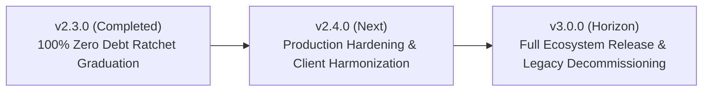

# Powercord Architecture & Governance Roadmap

This document outlines upcoming architectural horizons, modernization goals, and sovereign governance initiatives for the Powercord ecosystem. Historical details of completed milestones and ratchet graduations are maintained in [`CHANGELOG.md`](CHANGELOG.md).

---

## 1. Architectural Debt Ratchet Status

The 500 LOC Ceiling Law (`inv-500-loc-ceiling`) establishes that no source file shall exceed 500 lines of code.

* **Status**: **100% Graduated (Zero Architectural Debt)**
* **Quarantined Files**: **0** (see [`tests/governance/governance_ratchet.json`](tests/governance/governance_ratchet.json))
* **Policy**: Zero tolerance for new debt. All new modules and refactored code across the core framework, extensions, and downstream server must strictly satisfy $\le 500$ LOC, verified hermetically by `just check`.

---

## 2. Upcoming Milestones

### Milestone v2.4.0: Production Hardening & Client Harmonization
* **Focus**: Solidifying downstream production workflows, desktop client integration, and continuous repository hygiene.
* **Key Initiatives**:
  1. **Downstream Production Synchronization**: Validate production Cloud Build submission exclusively from locked downstream assembly (`inv-downstream-deploy-origin`) with pre-deploy QA gating (`inv-pre-deploy-qa-and-backup-gate`).
  2. **Desktop Companion Client Harmonization**: Refine async RPC and REST integration between `powercord-client` (Flet) and the server framework, enforcing strict client-server decoupling (`inv-client-server-decoupling`).
  3. **Automated Container & Cache Hygiene**: Integrate build cache pruning checks into development cycles to permanently eliminate dangling layer accumulation (`inv-single-vm-cost-ceiling`).
  4. **Dynamic Living Canon Evolution**: Expand progressive skills (`.agents/skills/`) to capture operational learnings while keeping root `AGENTS.md` context-efficient (<800 tokens).

---

### Milestone v3.0.0: Full Ecosystem General Availability & Legacy Decommissioning
* **Focus**: First general availability (`1.0.0`) release of external extensions, external client migration completion, and final removal of legacy migration shims.
* **Key Initiatives**:
  1. **Legacy v2 Migration Decommissioning**: Once external client maintainers (LuteBot) migrate to the v3 REST API, delete legacy compatibility artifacts (`app/main_api.py`, `nginx.conf`, `app/db/db_tools.py` `--migration` flag) as scheduled in [`docs/LEGACY_V2_MIGRATION.md`](docs/LEGACY_V2_MIGRATION.md).
  2. **Decoupled Extension GA**: Independent versioning and distribution for external extensions (`honeypot`, `midi_library`) hitting their initial `1.0.0` stable releases (`inv-manifest-version-parity`).
  3. **Multi-Platform Desktop Distribution**: Automated cross-platform packaging and binary distribution for `powercord-client`.
