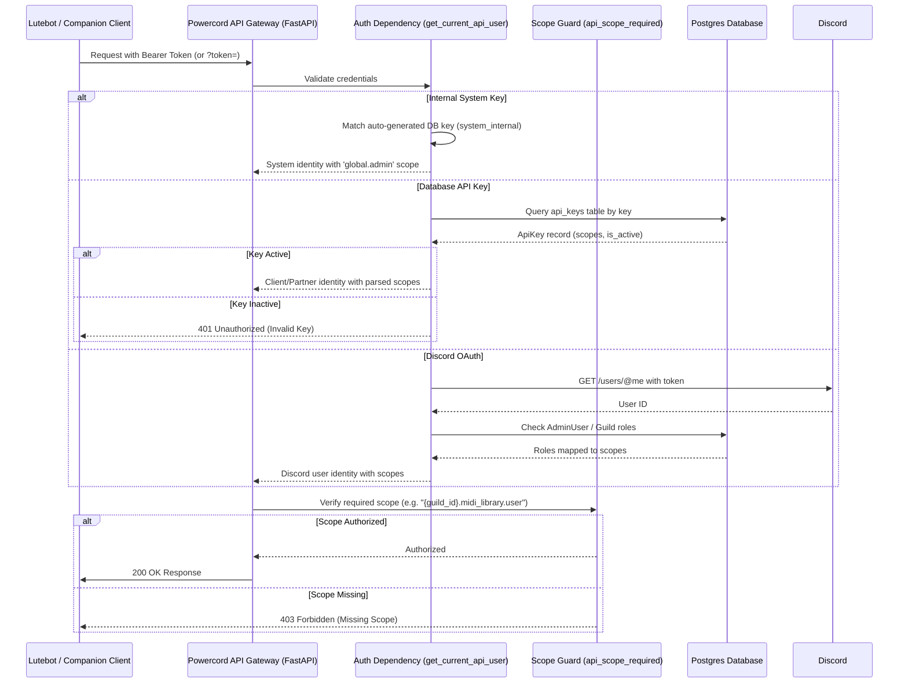

# Powercord REST API Developer Guide

This document is the official reference for the Powercord REST API, designed for developers integrating third-party tools, companion clients, or modernized cogs/mods such as **Lutebot** and **Lutemod**.

---

## 1. System Architecture & Flow Diagrams

Powercord uses a decoupled extension structure. When FastAPI starts up, the core framework registers dynamically discovered extension routers (called **Sprockets**) under their respective namespace prefixes, automatically securing them behind granular permission-check dependencies.

### Unified Request Authentication & Authorization Flow


### Lutebot Integration Migration Flow
```mermaid
graph TD
    subgraph Legacy Integration (v2 Compatibility Shim)
        A[Lutebot / Lutemod] -->|GET /midi_library/legacy/?key=KEY&find=TERM| B(FastAPI Legacy Compatibility Shim)
        B -->|Fuzzy Trigram Match| C[(Postgres DB)]
        B -->|Returns Legacy Flat JSON Row| A
    end

    subgraph Modern Integration (v3 Sprocket API)
        D[Modernized Lutebot / Lutemod] -->|GET /midi_library/search?q=TERM| E(FastAPI sprocket Router)
        D -.->|Auth: Bearer Token| E
        E -->|Fuzzy Trigram Match| C
        E -->|Returns Structured JSON Model| D
    end

    style Legacy Integration fill:#ffe6e6,stroke:#f00,stroke-width:2px
    style Modern Integration fill:#e6f2ff,stroke:#00f,stroke-width:2px
```

---

## 2. API Security & Access Controls

Powercord implements a unified authentication model that validates three types of credentials:

1. **Internal System Keys**: Autogenerated secure tokens used for inter-service communication (e.g., bot talking to web server).
2. **Database API Keys**: Persistent, cryptographically secure keys mapped to specific user or partner scopes.
3. **Discord OAuth Tokens**: Temporary tokens generated during user logins to the Discord dashboard.

### Granular Scopes

API endpoints require specific scopes to authorize request execution:
* **Global Scopes**:
  * `global.admin`: Full administrative access (bypasses all security checks).
  * `global.user`: Global read-only access.
* **Core Scopes**:
  * `core.admin`: Full write access to core administrative endpoints (restart, reload config, toggle extensions).
  * `core.user`: Read-only access to core configurations and metadata (list guilds, view status).
* **Extension Scopes** (Multi-tenant):
  * `{guild_id}.{extension}.admin`: Full write access for a specific extension on a specific server.
  * `{guild_id}.{extension}.user`: Read-only access for a specific extension on a specific server.

### API sprocket Gating vs. Discord Bot Command Gating (Role Checks)

There is a clean separation of security responsibilities between the REST API (Sprocket endpoints) and the Discord Bot Cog commands:

1. **Discord Cog Slash Commands (`/scan`)**:
   * **Gating**: Gated directly inside Discord using command permission decorators:
     ```python
     @nextcord.slash_command(
         description="...",
         default_member_permissions=nextcord.Permissions(administrator=True)
     )
     ```
     This strictly guarantees that only server members with the `Administrator` permission can invoke the `/scan` bot command.
   * **Execution**: When run, the bot itself queries Discord's message history, compiles the list of attachments, and calls the API backend via loopback (`localhost:8000`) using the **Internal System Key** (`POWERCORD_INTERNAL_API_KEY`), which grants the bot `global.admin` scope.

2. **REST API sprocket Endpoints (`POST /midi_library/scan`)**:
   * **Gating**: Securely restricted by the `api_scope_required(extension_name, level)` dependency generator. It does **not** perform dynamic Discord guild role checks directly on the API route. Instead, it delegates authority to **scopes** attached to the authenticated caller's identity:
     * **API Keys (Third-Party/Partner)**: Gated strictly on key creation. To run the `/midi_library/scan` sprocket directly, a partner API key must be created with the `{guild_id}.midi_library.admin` or `global.admin` scope.
     * **Discord OAuth Tokens**: For a user's Discord OAuth token to access `/midi_library/scan`, they must either:
       1. Be configured as a global administrator in the `admin_users` table (granting them the `global.admin` scope).
       2. Be the Server Owner or hold a role in the target server that is mapped to the `midi_library` extension in the `api_access_roles` table.

---

## 3. Web Dashboard Key Management

### Companion Client Keys (User Profile)

Global administrators can self-service generate and revoke **Companion Client Keys** designed to authenticate official or third-party Powercord companion applications (such as the Powercord Desktop or Mobile clients) via the **Profile** section of the Powercord Web Dashboard (`/profile`).

* **Generation**: Toggled under a single **"+ Generate Client Key"** button. Clicking the button expands the form inline to display:
  * **Scopes**: Multi-select checkbox cards structured as `Global: admin`, `Global: user`, `Global: {extension}.admin`, etc.
  * **Information Tooltip**: A DaisyUI info tooltip next to the "Select Scope(s)" label explaining scope format.
* **Revocation**: Clicking "Revoke" on an active key immediately invalidates the key.
* **Key Format**: Prefix `pc_` followed by a cryptographically secure, url-safe token.
* **Name Format**: Bound to the Discord ID (`client_{discord_user_id}_{random_hex_suffix}`).

### Self-Service Guild Keys (Server Dashboard)

Guild administrators and users with the designated **API User Role** can generate server-specific API keys via the **Guild Dashboard** page (`/dashboard/{guild_id}`):

* **Access Gating**:
  * **Server Owners & Powercord Admins**: Can configure "Dashboard Access Roles", set the designated "API User Role", and generate keys with `{guild_id}.{extension}.admin` or `{guild_id}.{extension}.user` scopes.
  * **Self-Service Users**: Users possessing dashboard access and the designated "API User Role" can generate keys, but are restricted to selecting only `{guild_id}.{extension}.user` scopes. (Admin scope checkboxes are hidden/disabled).
* **Generation**: Under a single toggleable **"+ Generate API Key"** button, which expands inline to show a text box for the **Key Label** and a clean 2-column grid of checkbox cards formatted as `Readable Guild Name: extension.user` (e.g. `NerdMercs: custom_content.user`).
* **Name Format**: `guild_{guild_id}_{discord_user_id}_{label}_{random_hex_suffix}` (where `{label}` is the user-provided key label).

### Global Keys Management (Web Admin Dashboard)

Global Powercord Admins can monitor, revoke, and reactivate all API keys across the system (both client keys and guild keys) via the **Manage API Keys** panel on the admin page (`/admin`):
* Displays key ID, name, status (Active/Inactive), key type, parsed scopes list, and creation timestamp.
* Active keys feature a yellow "Revoke" button.
* Revoked keys feature a green "Reactivate" button.

### System Admin CLI
Administrators can also manage keys from the command-line terminal:
* **Create a Partner API Key**:
  ```bash
  just add-api-key <name> [--scopes '<json_scope_list>'] [--key <legacy_key>]
  ```
* **List All Keys**:
  ```bash
  just list-api-keys
  ```
* **Revoke any API Key**:
  ```bash
  just revoke-api-key <key_id>
  ```

---

## 4. Core API Reference

### Core Operations

#### `GET /`
Returns the operational status of the Powercord API.
* **Auth Required**: `core.user` or higher.
* **Response**:
  ```json
  {"Hello": "World"}
  ```

#### `POST /reload_config`
Signals the API to reload settings for a specific guild.
* **Auth Required**: `core.admin` or higher.
* **Request Body**:
  ```json
  {"guild_id": 123456789}
  ```

#### `POST /restart`
Gracefully terminates the API process. Relying process managers (e.g., systemd/supervisord) will automatically bring the server back online.
* **Auth Required**: `core.admin` or higher.

---

### Client Management

These endpoints permit companion app dashboards to query and toggle configurations for individual Discord servers (Guilds).

#### `GET /client/guilds`
Retrieves all Discord servers the authenticated user administrates.
* **Auth Required**: `core.user` or higher.
* **Response**:
  ```json
  {
    "guilds": [
      {
        "id": 123456789,
        "name": "My Discord Guild",
        "icon": "icon_hash"
      }
    ],
    "is_global_admin": false
  }
  ```

#### `GET /client/guilds/{guild_id}/config`
Retrieves configuration state for all dynamically discovered extensions on the server.
* **Auth Required**: `core.user` or higher (user must also have guild dashboard access).
* **Response**:
  ```json
  {
    "config": [
      {
        "name": "midi_library",
        "gadgets": ["cog", "sprocket", "widget"],
        "is_enabled": true
      }
    ]
  }
  ```

#### `POST /client/guilds/{guild_id}/config/toggle`
Toggles an extension on or off for the guild.
* **Auth Required**: `core.admin` or higher (user must also be server owner/admin).
* **Request Body**:
  ```json
  {
    "extension_name": "midi_library",
    "enabled": false
  }
  ```

---

## 5. Extension API Reference

### MIDI Library Extension (`midi_library`)

This extension serves the centralized MIDI catalog. All routes require dynamic scope validation.

#### `GET /midi_library/`
Retrieves global library stats.
* **Auth Required**: `{guild_id}.midi_library.user` or higher.
* **Response**:
  ```json
  {
    "total_midis": 452,
    "average_quality": 68.4
  }
  ```

#### `GET /midi_library/search`
Performs a fast trigram-based fuzzy search against MIDI filenames and tags.
* **Auth Required**: `{guild_id}.midi_library.user` or higher.
* **Query Parameters**:
  * `q` (string, *required*): Fuzzy query term.
  * `limit` (int, default=10): Maximum results to return.
* **Response**:
  ```json
  [
    {
      "checksum": "3a7b...",
      "filename": "Through the Fire and Flames.mid",
      "contributor": "GuildBard",
      "tags": "guitar,fast,metal"
    }
  ]
  ```

#### `GET /midi_library/random`
Retrieves a random list of files for public galleries.
* **Auth Required**: `{guild_id}.midi_library.user` or higher.
* **Query Parameters**:
  * `count` (int, default=24, min=1, max=100)
* **Response**:
  ```json
  [
    {
      "checksum": "f82b...",
      "filename": "Morrowind Theme.mid",
      "contributor": "Nerevarine",
      "quality_score": 92
    }
  ]
  ```

#### `GET /midi_library/{checksum}`
Retrieves basic details and metadata analysis for a specific checksum.
* **Auth Required**: `{guild_id}.midi_library.user` or higher.
* **Response**:
  ```json
  {
    "file": {
      "checksum": "3a7b...",
      "filename": "Through the Fire and Flames.mid",
      "contributor": "GuildBard",
      "tags": "guitar,fast,metal"
    },
    "meta": {
      "checksum": "3a7b...",
      "num_instruments": 4,
      "total_notes": 12850,
      "drum_percent": 15,
      "dup_percent": 2,
      "dup_count": 257,
      "track_diversity": 0.85,
      "quality_score": 88
    }
  }
  ```

#### `GET /midi_library/{checksum}/detail`
Retrieves full details including structural instrument breakdowns.
* **Auth Required**: `{guild_id}.midi_library.user` or higher.
* **Response**:
  ```json
  {
    "file": { ... },
    "meta": { ... },
    "instruments": [
      {
        "instrument": "Acoustic Grand Piano",
        "instrument_class": "Piano",
        "is_drum": false,
        "note_count": 8450
      },
      {
        "instrument": "Standard Drum Kit",
        "instrument_class": "Drums",
        "is_drum": true,
        "note_count": 4400
      }
    ]
  }
  ```

#### `POST /midi_library/scan`
Starts an asynchronous background scan of Discord channel attachments to import files.
* **Auth Required**: `{guild_id}.midi_library.admin` or higher.
* **Request Body (JSON)**:
  ```json
  {
    "contributor": "DiscordImporter",
    "attachments": [
      {
        "url": "https://cdn.discordapp.com/...",
        "filename": "song.mid"
      }
    ]
  }
  ```
* **Response**:
  ```json
  {
    "job_id": "9b1deb4d-3b7d-4bad-9bdd-2b0d7b3dcb6d"
  }
  ```

#### `GET /midi_library/scan/{job_id}`
Retrieves progress/status of the background importer job.
* **Auth Required**: `{guild_id}.midi_library.user` or higher.
* **Response**:
  ```json
  {
    "job_id": "9b1deb4d-3b7d-4bad-9bdd-2b0d7b3dcb6d",
    "status": "processing",
    "total": 5,
    "processed": 2,
    "imported": 2,
    "current_file": "fast_track.mid"
  }
  ```

#### `POST /midi_library/upload`
Uploads a MIDI file or archive directly.
* **Auth Required**: `{guild_id}.midi_library.admin` or higher.
* **Content-Type**: `multipart/form-data`
* **Form Fields**:
  * `file`: (Binary data of `.mid`, `.zip`, `.rar`, or `.7z`)
  * `contributor`: "Name of contributor"
  * `tags`: "comma,separated,tags"
* **Response**:
  ```json
  {
    "job_id": "autogenerated-job-uuid"
  }
  ```

---

### Honeypot Extension (`honeypot`)

Enables spam prevention and moderation configurations.

#### `POST /honeypot/config/{guild_id}/settings`
Updates guild-level honeypot parameters.
* **Auth Required**: `{guild_id}.honeypot.admin` or higher.
* **Content-Type**: `application/x-www-form-urlencoded`
* **Form Parameters**:
  * `time_limit` (integer): Auto-kick threshold time limit (seconds).
  * `log_channel_id` (integer): Log target channel.
  * `shame_mode` (boolean, default=false): Sends public kick announcements.

#### `POST /honeypot/config/{guild_id}/remove_channel`
Removes a channel from active honeypot monitoring.
* **Auth Required**: `{guild_id}.honeypot.admin` or higher.
* **Content-Type**: `application/x-www-form-urlencoded`
* **Form Parameters**:
  * `channel_id` (integer)

#### `POST /honeypot/config/{guild_id}/clear_channels`
Cleans up and removes all monitored channels.
* **Auth Required**: `{guild_id}.honeypot.admin` or higher.

---

### Utilities Extension (`utilities`)

Provides auditing parameters generated by the Discord Permission Auditor.

#### `GET /utilities/api/guild/{guild_id}/audit/score`
Calculates and retrieves the server's security health score.
* **Auth Required**: `{guild_id}.utilities.user` or higher.
* **Response**:
  ```json
  {
    "score": 85,
    "severities": {
      "high": 1,
      "medium": 0,
      "low": 2
    }
  }
  ```

#### `GET /utilities/api/guild/{guild_id}/audit/config`
Retrieves active auditor config parameters.
* **Auth Required**: `{guild_id}.utilities.user` or higher.
* **Response**:
  ```json
  {
    "staff_separator_role_id": 987654321,
    "staff_channel_ids": [101, 102],
    "announcement_channel_ids": [103]
  }
  ```

#### `POST /utilities/api/guild/{guild_id}/audit/config`
Saves new Auditor settings.
* **Auth Required**: `{guild_id}.utilities.admin` or higher.
* **Request Body (JSON)**:
  ```json
  {
    "staff_separator_role_id": 987654321,
    "staff_channel_ids": [101, 102],
    "announcement_channel_ids": [103]
  }
  ```

#### `GET /utilities/api/guild/{guild_id}/audit/alerts`
Lists active security auditor alerts.
* **Auth Required**: `{guild_id}.utilities.user` or higher.
* **Query Parameters**:
  * `category` (string, optional)
* **Response** (bare list, not wrapped in an object):
  ```json
  [
    {
      "rule": "Low-Tier Role Privileges",
      "category": "Role Security",
      "message": "Low-tier role 'LowTierAdmin' holds high-severity 'Administrator' permission.",
      "details": "Detailed explanation of the finding.",
      "severity": "high",
      "alert_hash": "a4f8d9...",
      "parent_hash": null,
      "child_count": 2
    }
  ]
  ```

---

## 6. Lutebot & Lutemod Migration Guide

Lutebot historically requested data using a legacy query format. Powercord maintains a temporary **Legacy compatibility shim** at `/midi_library/legacy/` (which translates incoming v2 queries into v3 database lookups). This shim is deprecated and will be removed.

> [!IMPORTANT]
> The legacy compatibility endpoint is **restricted to the legacy Lutebot API Key**. Developers must transition to the modern Sprocket API `/api/midi_library/...` endpoints and request a new scoped API Key from the server administrator.

### Comparison Table

| Aspect | Legacy (v2 Compat Shim) | New Sprocket (v3 API) |
|---|---|---|
| **Root Path** | `https://api.bardsguild.life/?key=...` | `https://midi.gallery/api/midi_library/search` |
| **Authentication** | Query parameter: `?key=LEGACY_KEY` | HTTP Header: `Authorization: Bearer KEY` |
| **Response Format** | Flat dictionary (raw SQL row mapping) | Structured nested JSON models |
| **Fuzzy Search Key** | `find` | `q` |
| **Direct Lookup Key**| `checksum` | Path variable: `/{checksum}` |
| **Pagination** | `limit` (default 20, max 50) + `page` | `limit` query parameter |
| **Sorting** | `sort` + `order` (asc/desc) | N/A (ranked by trigram similarity) |
| **Count Query** | `find` + `count` | N/A |

### Field Mapping

The legacy API returned a flat `SELECT midi.*, meta.*` row join. If your parsing engine expects the v2 format, map the new v3 models using this reference:

| Legacy Field | v3 Model Source | Migration Notes |
|---|---|---|
| `checksum` | `MidiFile.checksum` | Stored as a hex-encoded SHA-256 string. |
| `filename` | `MidiFile.filename` | String. |
| `contributor` | `MidiFile.contributor` | String. |
| `tags` | `MidiFile.tags` | Comma-separated tags string. |
| `num_instruments`| `MidiMeta.num_instruments` | Integer. |
| `total_notes` | `MidiMeta.total_notes` | Integer. |
| `drum_percent` | `MidiMeta.drum_percent` | Integer (0-100). |
| `dup_percent` | `MidiMeta.dup_percent` | Integer (0-100). |
| `dup_count` | `MidiMeta.dup_count` | Integer. |
| `m_score` | `MidiMeta.quality_score` | Integrates new scoring algorithms; values will differ from legacy scores. |
| `source_url` | *(Deprecated)* | **Always returns `null`**; no longer tracked. |
| `title` | *(Deprecated)* | **Always returns `null`**. |
| `artist` | *(Deprecated)* | **Always returns `null`**. |
| `optimal_low` | *(Deprecated)* | **Always returns `null`** (decoupled from client-specific instrument ranges). |
| `optimal_high` | *(Deprecated)* | **Always returns `null`**. |
| `deviance` | *(Deprecated)* | **Always returns `0`**; no longer tracked. |

### Migration Example: Search Implementation

#### Legacy Query (Python Example)
```python
import requests

legacy_url = "https://api.bardsguild.life/"
params = {
    "key": "LEGACY_LUTEBOT_API_KEY",
    "find": "Through the Fire",
    "limit": 20
}
response = requests.get(legacy_url, params=params).json()
for row in response:
    print(f"Song: {row['filename']}, Score: {row['m_score']}")
```

#### Modernized Query (Python Example)
```python
import requests

modern_url = "https://midi.gallery/api/midi_library/search"
headers = {
    "Authorization": "Bearer YOUR_V3_API_KEY"
}
params = {
    "q": "Through the Fire",
    "limit": 20
}
response = requests.get(modern_url, headers=headers, params=params).json()
for item in response:
    # Each item returned is a MidiFile model.
    # To get details like quality score, make a detail call for the checksum.
    print(f"Song: {item['filename']}, Checksum: {item['checksum']}")
```
